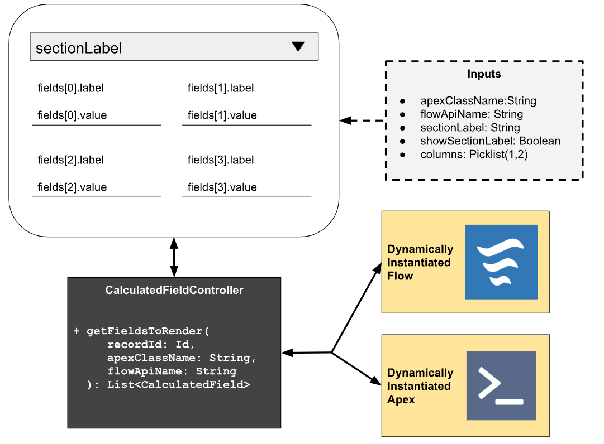
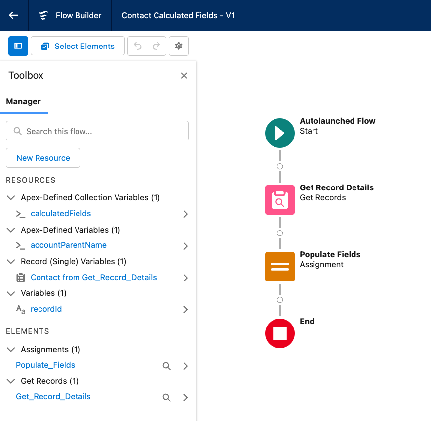
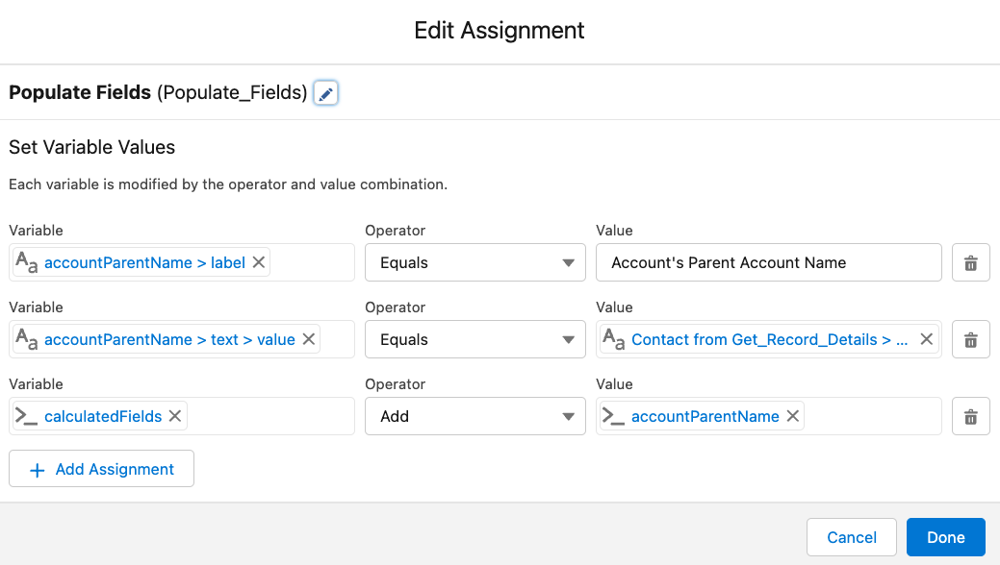
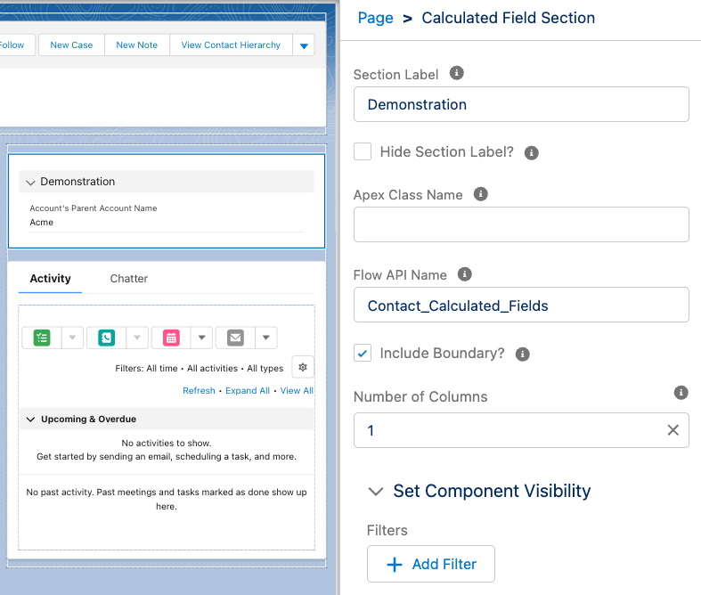
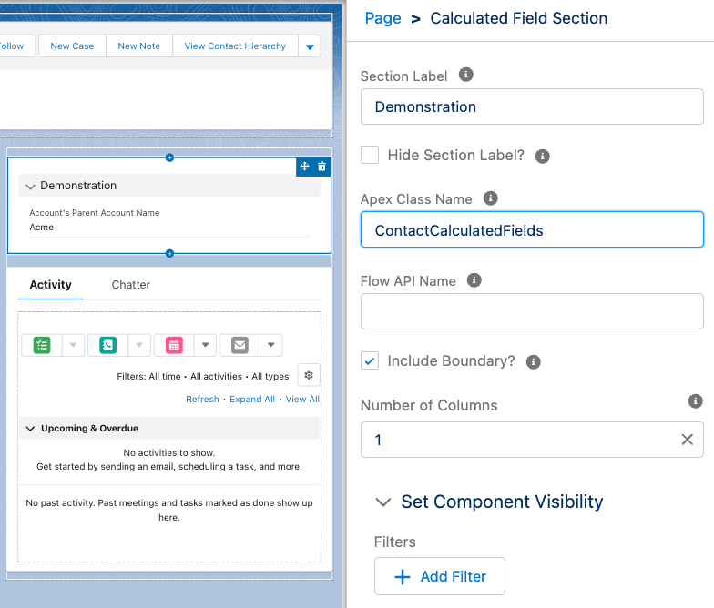

# Calculated Fields

Evolve Forms allows administrators and developers to dynamically calculate any value to be rendered on the screen as if it were an actual field using Apex or Flow.

This is _far more_ robust than normal formula fields. Calculated Fields enables rendering data calculated from child records or the result of a callout, and it does not consume any columns in the schema.

If you can compute it in Apex or Flow, then you can render it on the screen as if it were a field.



## Renderers

The fields will be calculated using a **Renderer**. A renderer will accept the current record's Id as input and return a collection of `CalculatedField` objects.

The `CalculatedField` class has public `@AuraEnabled` variables whose data types correspond to the public properties of the `lightning-formatted-XYZ` Lightning Web Component.

<!-- prettier-ignore -->
| Data Type | Lightning Web Component |
| --- | --- |
| [LightningFormattedAddress](../evolve-forms/main/default/classes/LightningFormattedAddress.cls) |  [lightning-formatted-address](https://developer.salesforce.com/docs/component-library/bundle/lightning-formatted-address/example) | 
| [LightningFormattedDateTime](../evolve-forms/main/default/classes/LightningFormattedDateTime.cls) | [lightning-formatted-date-time](https://developer.salesforce.com/docs/component-library/bundle/lightning-formatted-date-time/example) | 
| [LightningFormattedEmail](../evolve-forms/main/default/classes/LightningFormattedEmail.cls) | [lightning-formatted-email](https://developer.salesforce.com/docs/component-library/bundle/lightning-formatted-email/example) | 
| [LightningFormattedLocation](../evolve-forms/main/default/classes/LightningFormattedLocation.cls) | [lightning-formatted-location](https://developer.salesforce.com/docs/component-library/bundle/lightning-formatted-location/example) | 
| [LightningFormattedName](../evolve-forms/main/default/classes/LightningFormattedName.cls) | [lightning-formatted-name](https://developer.salesforce.com/docs/component-library/bundle/lightning-formatted-name/example) | 
| [LightningFormattedNumber](../evolve-forms/main/default/classes/LightningFormattedNumber.cls) | [lightning-formatted-number](https://developer.salesforce.com/docs/component-library/bundle/lightning-formatted-number/example) | 
| [LightningFormattedPhoneNumber](../evolve-forms/main/default/classes/LightningFormattedPhoneNumber.cls) | [lightning-formatted-phone](https://developer.salesforce.com/docs/component-library/bundle/lightning-formatted-phone/example) | 
| [LightningFormattedUrl](../evolve-forms/main/default/classes/LightningFormattedUrl.cls) | [lightning-formatted-url](https://developer.salesforce.com/docs/component-library/bundle/lightning-formatted-url/example) | 
| [LightningFormattedText](../evolve-forms/main/default/classes/LightningFormattedText.cls) | [lightning-formatted-text](https://developer.salesforce.com/docs/component-library/bundle/lightning-formatted-text/example)<br/>[lightning-formatted-rich-text](https://developer.salesforce.com/docs/component-library/bundle/lightning-formatted-rich-text/example) |
| Boolean| [lightning-input](https://developer.salesforce.com/docs/component-library/bundle/lightning-input/example) (rendered as `type="checkbox"`) |

The values in the populated data type will be rendered on the screen as if it were a field on the record, using all of the formatting capabilities of the corresponding Lightning Web Component.

## Flow Renderers

To define a flow-based renderer, create an autolaunched flow with the following variable specifications:

<!-- prettier-ignore -->
| Variable Name | Variable Type | Available for Input | Available for Output | Description |
| --- | --- | --- | --- | --- |
| `recordId` | text | yes | no | The Id of the record | 
| `calculatedFields` | Collection of [`CalculatedField`](evolve-forms/main/default/classes/CalculatedField.cls) | no | yes  | The calculated fields to be rendered on the screen |





Then, add the `Calculated Fields Section` component to your record page and provide the flow's API name.



## Apex Renderers

Apex renderers work very similarly to flow renderers. Create a class which implements the `CalculatedFieldController.Renderer` interface:

```java
public class ContactCalculatedFields implements CalculatedFieldController.Renderer {
  public List<CalculatedField> getFields(Id recordId) {
    List<CalculatedField> result = new List<CalculatedField>();

    List<Contact> contacts = [
      SELECT Account.Parent.Name
      FROM Contact
      WHERE Id = :recordId
    ];

    String parentAccountName = contacts?.get(0)?.Account?.Parent?.Name;
    if (parentAccountName == null) {
      return result;
    }

    CalculatedField field = new CalculatedField();
    field.label = 'Account\'s Parent Account Name';
    field.text = new LightningFormattedText();
    field.text.value = parentAccountName;

    result.add(field);
    return result;
  }
}
```

Then, add the `Calculated Fields Section` component to your record page and provide the Apex class name.


