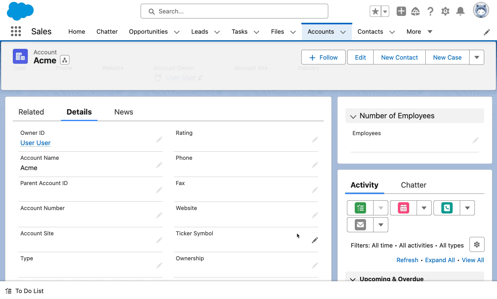

# Custom Components

Evolve Forms enables developers to build custom components which can be used to
enter data in a non-standard way while choreographing the saving of the record
with the same set of edit/save/cancel buttons as the rest of the page.

In the below example, we created a custom slider component and have the value of
the slider map to the `Account.NumberOfEmployees` field for the record.



#### sliderDemo.html

<!-- prettier-ignore -->
```html
<template
  ><div class="slds-box slds-theme_default">
    <template if:false={editMode}>
      <c-dynamic-forms-field-section
        record-id={recordId}
        object-api-name={objectApiName}
        section-label={label}
        field-api-names={fieldApiName}
        columns="1"
      >
      </c-dynamic-forms-field-section>
    </template>
    <template if:true={editMode}>
      <lightning-slider
        label={label}
        value={currentFieldValue}
        onchange={handleSliderChange}
      ></lightning-slider>
    </template>
  </div>
</template>
```

#### sliderDemo.js

```js
import { api, wire } from "lwc";
import { getRecord } from "lightning/uiRecordApi";
import DynamicFormsElement from "c/dynamicFormsElement";

export default class SliderDemo extends DynamicFormsElement {
  @api recordId;
  @api objectApiName;
  @api label;
  @api fieldApiName;
  editMode = false;

  @wire(getRecord, {
    recordId: "$recordId",
    fields: [""],
    optionalFields: "$fieldName"
  })
  thisRecord;

  get fieldName() {
    return this.objectApiName + "." + this.fieldApiName;
  }

  get currentFieldValue() {
    return this?.thisRecord?.data?.fields[this.fieldApiName]?.value;
  }

  handleSliderChange(event) {
    this.broadcast(this.EVENT_TYPE.UPDATE, {
      newValue: event.detail.value,
      fieldApiName: this.fieldApiName
    });
  }

  handleMessage(message) {
    if (message.eventType === this.EVENT_TYPE.EDIT) {
      this.editMode = true;
    } else if (message.eventType === this.EVENT_TYPE.CANCEL) {
      this.editMode = false;
    } else if (message.eventType === this.EVENT_TYPE.SAVE_START) {
      this.showSpinner = true;
    } else if (message.eventType === this.EVENT_TYPE.SAVE_END) {
      this.showSpinner = false;
    }
  }

  connectedCallback() {
    this.subscribeToMessageChannel();
    this.broadcast(this.EVENT_TYPE.CHECK_EDIT);
  }
}
```

#### sliderDemo.js-meta.xml

```xml
<?xml version="1.0" encoding="UTF-8"?>
<LightningComponentBundle xmlns="http://soap.sforce.com/2006/04/metadata">
    <apiVersion>59.0</apiVersion>
    <isExposed>true</isExposed>
    <masterLabel>Slider Demonstration</masterLabel>
    <description>This enables the value of a slider to be saved to a number field.</description>
    <targets>
        <target>lightning__RecordPage</target>
    </targets>
    <targetConfigs>
        <targetConfig targets="lightning__RecordPage">
            <property name="label" type="String" label="Label" description="Enter the API name of the field you would like the slider to be tied to."></property>
            <property name="fieldApiName" type="String" label="Field API Name" description="Enter the label."></property>
        </targetConfig>
    </targetConfigs>
</LightningComponentBundle>
```

## Event Details

Here are the supported
[event types](/evolve-forms/main/default/lwc/dynamicFormsElement/dynamicFormsElement.js)
which Evolve Forms uses to facilitate all interactions. Use these when building
custom components that interact with the rest of the Evolve Forms Page Layout and
Field Section components on the page.

<!-- prettier-ignore -->
| Event | Description |
| --- | --- | 
| CANCEL                   | Broadcast that the form should cancel the current form modifications |
| CHECK_EDIT               | Check if the form is currently in edit mode                          |
| CHECK_OVERRIDES          | Check if any form values should be overridden by a pre-populated value |
| EDIT                     | Broadcast that the form should switch to edit mode                   |
| FOCUS_IN                 | Broadcast that an input element got focus                            |
| FOCUS_OUT                | Broadcast that an input element focused out                          |
| NO_LONGER_REQUIRED_FIELD | Broadcast to remove requirement from a field which is no longer required   |
| REQUIRED_FIELD           | Broadcast that this element contains a required field                |
| RESET                    | Broadcast to reset current form fields                               |
| SAVE_END                 | Broadcast that the form has finished saving                          | (successful or not)                 |
| SAVE_START               | Broadcast that the form has begun to save                            |
| UPDATE                   | Broadcast that a field value is updated                              |
