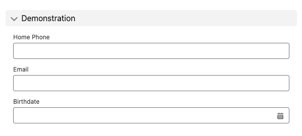
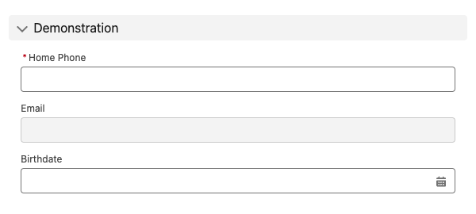
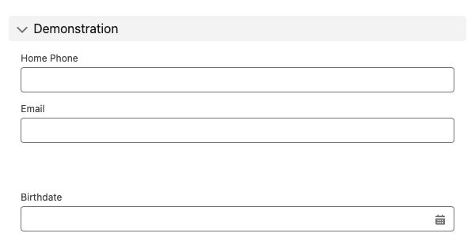
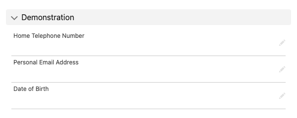
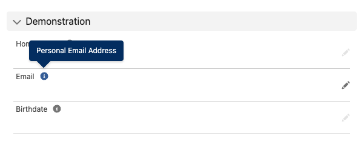
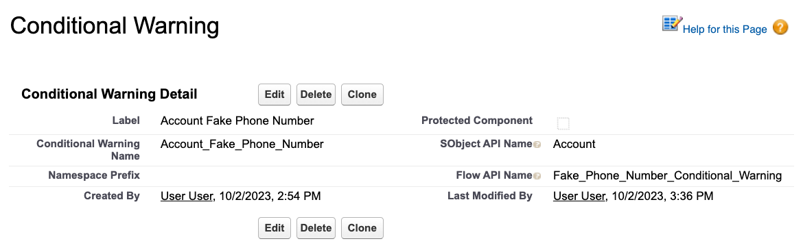
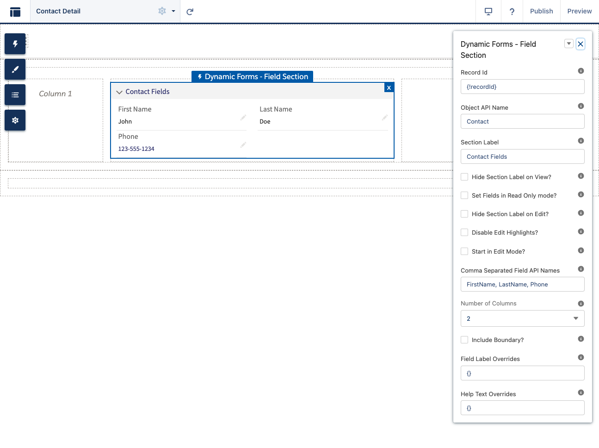

# Editing Records

Editing records using Evolve Forms uses an implementation of the
[Mediator Pattern](https://en.wikipedia.org/wiki/Mediator_pattern) which works
by using the
[Lightning Message Service](https://developer.salesforce.com/docs/component-library/documentation/en/lwc/lwc.use_message_channel)
to propagate events across the
[Lightning Record Page](https://trailhead.salesforce.com/content/learn/modules/lightning_app_builder/lightning_app_builder_recordpage)
to manipulate form state, capture data, and orchestrate user interactions.

The cancel/save buttons component act as the event hub and mediate all
communication across the components on the Lightning Record Page. They hold all
pending record updates in-memory and choreograph the save of the record with
input gathered from all of the components on the page.

### Page Layouts

Evolve Forms is _fully backwards compatible_ with Page Layouts, so all of the
existing Page Layouts you have in your org can be easily used with the
framework. Just drag the `Dynamic Forms - Page Layout` component onto the
Lightning Record Page.

By default, the page layout that is assigned will be rendered. You can also
enter the API name of a different page layout into the `Page Layout Name` field
in page builder, and _override the default page layout assignment_:

You can even _render multiple page layouts_ on one Lightning Record Page if you
like!

#### Field Sections

Evolve Forms provides the ability for "Field Sections" to be added to the
Lightning Record Page which are independent of the page layout. Just drag and
drop the `Dynamic Forms - Field Section` component onto the page layout:

Edits from all field sections and page layouts will be orchestrated together, so
the same set of edit/save/cancel buttons control the entire page.

##### Comma Separated Field API Names

To use the `Dynamic Forms - Field Section` component, enter the "Section Label"
you would like to display and the "Comma Separated Field API Names" which you
would like to render. Use the below mapping to label fields as required, read
only, or to insert additional blank spaces:

| String Format        | Description             |
| -------------------- | ----------------------- |
| Prefix with Asterisk | Mark field as required  |
| Suffix with Asterisk | Mark field as read-only |
| Sequential Commas    | Introduce blank space   |

Here are some examples:

| Comma Separated Field API Names | Image                                             |
| ------------------------------- | ------------------------------------------------- |
| HomePhone, Email, Birthdate     |     |
| \*HomePhone, Email\*, Birthdate |   |
| HomePhone, Email, , Birthdate   |  |
|                                 |                                                   |

#### Label and Help Text Overrides

Evolve Forms provides the ability to easily override the label or help text on a
given field. To accomplish this, enter a JSON object with simple key-value pairs
to define the override for a particular field.

Here are some examples:

| Override                                                                                                                                                        | Image                                                  |
| --------------------------------------------------------------------------------------------------------------------------------------------------------------- | ------------------------------------------------------ |
| **No Overrides**                                                                                                                                                |                        |
| **Field Label Overrides** {  "HomePhone" \: "Home Telephone Number",  "Email": "Personal Email Address", "Birthdate": "Date of Birth" }     |     |
| **Help Text Label Overrides** {  "HomePhone" \: "Home Telephone Number",  "Email": "Personal Email Address", "Birthdate": "Date of Birth" } |  |

**Note:** If a field doesn't have help text defined, then a label override is
also required to define a help text override.

#### Conditionally Rendered Warnings

Most folks working on Salesforce are familiar with
[Validation Rules](https://help.salesforce.com/s/articleView?id=sf.fields_defining_field_validation_rules.htm&type=5)
which can programmatically prevent the saving of a record based on some
evaluated criteria. Evolve Forms enables something unique which is not available
as part of the Salesforce platform - conditionally rendered _warnings_ (not
errors) based on the state of the current record before the save button is
pressed.

To enable these warnings, create a row of Custom Metadata in the
`Conditional_Warning__mdt` custom metadata type:

| Field                 | Type      | Description                                                                                                                                                                                                                                                                                                |
| --------------------- | --------- | ---------------------------------------------------------------------------------------------------------------------------------------------------------------------------------------------------------------------------------------------------------------------------------------------------------- |
| SObject_API_Name\_\_c | Text(255) | API name of the sObject that this conditional warning will be rendered on                                                                                                                                                                                                                                  |
| Flow_API_Name\_\_c    | Text(255) | The API name of a Flow which will be used to evaluate this warning. The flow must have an input variable called `record` of type sObject record and an output variable called `warningMessage` of type string. If `warningMessage` has a value, then that value will be rendered as a warning to the user. |

#### Digital Experience Support

Evolve Forms is compatible with Digital
Experience pages. Teams can use Evolve to easily create custom experiences
tailored to their exact needs.

**Note:** Evolve Forms Page Layouts are currently not supported in Digital
Experiences, only individual Field Sections.
