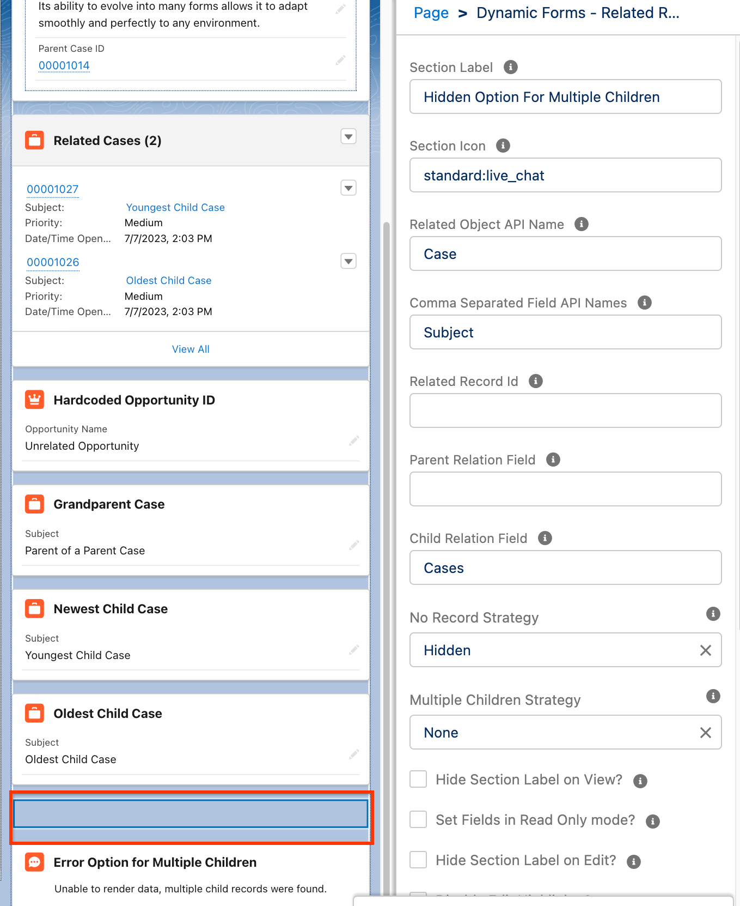
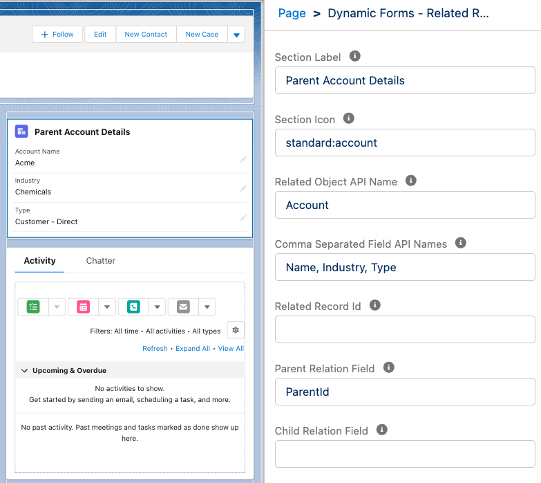
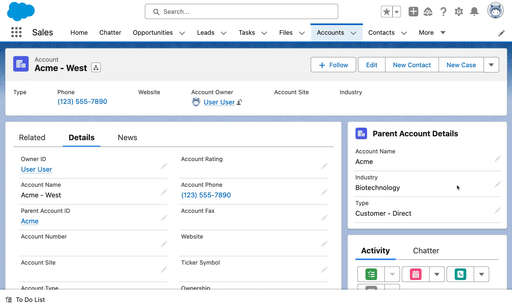

# Parent and Child Records

Evolve Forms allows developers and administrators to easily render and edit fields from related records on the same page.

This record can be defined by either defining a relational field to the current object or passing in a record Id (this use case would most likely be used in conjunction with other LWC extensions utilizing this component).

Relational fields include both parents and children. Parent can span multiple records (e.g. `Parent.Parent.Id` for a case's grandparent, spanning up to five relations). Children fields can also be included (e.g. `Cases` for child cases).

For child objects, there are multiple strategies to follow if multiple children are found (use the oldest, use the newest, throw an error, hide the component). This can be helpful for child relations where you expect a one-to-one relation.

