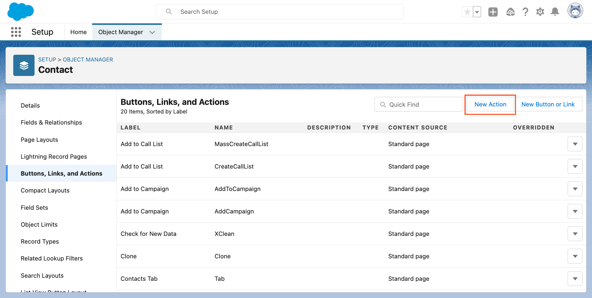
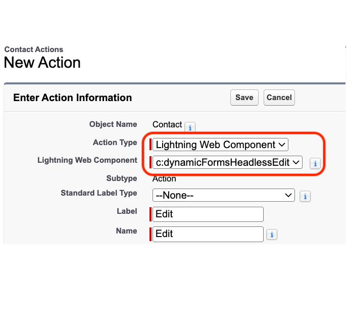
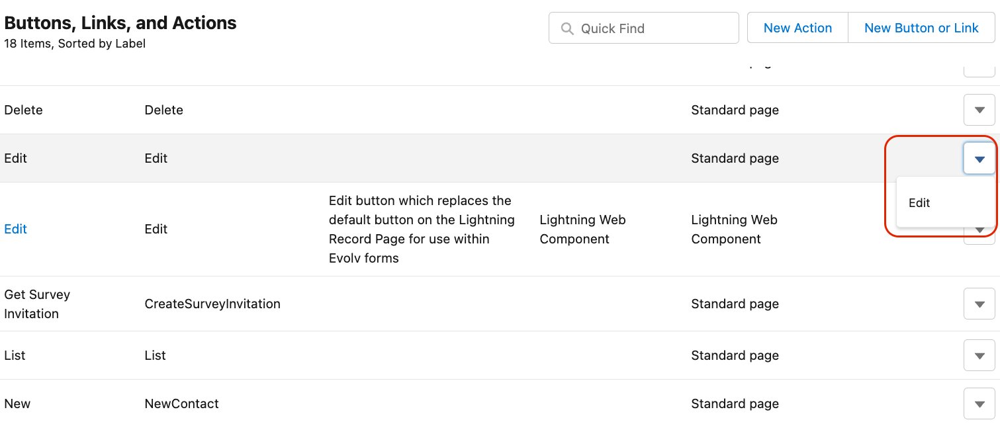
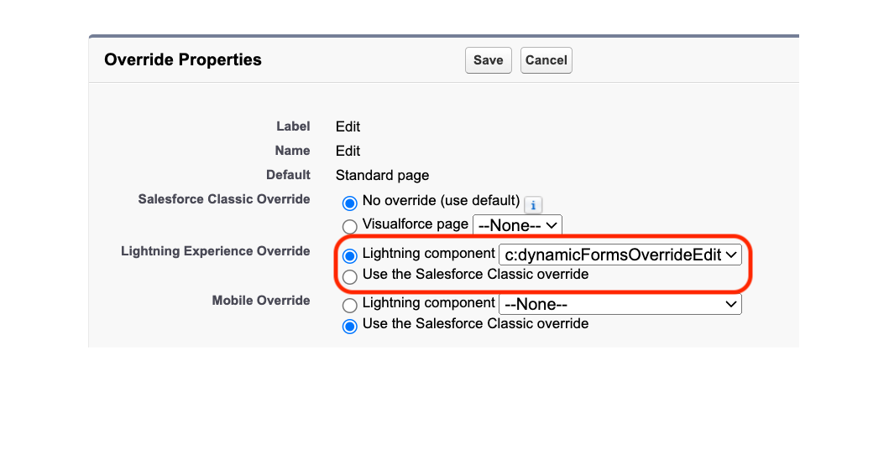
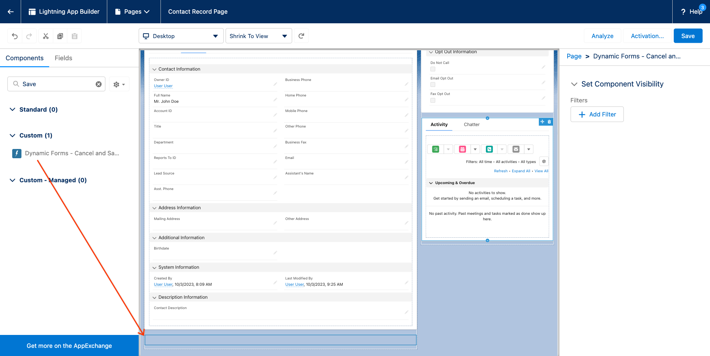

# Setup

There are a few steps necessary to get started using Evolve Forms on a given
sObject within your org.

### 1. Replace the Default Edit Button

Evolve Forms uses a custom `Edit` button on the lightning record page, so we need
to modify the page layout to remove the standard `Edit` button and replace it.

##### Create Edit Button for Page Layout

First, navigate to the setup menu, select the sObject you want to use Evolve on,
and create a new Action for that sObject:

Select the `c:dynamicFormsHeadlessEdit` Lightning Web Component and set the
Label as "Edit": 

Replace the edit button on the assigned page layout:

##### Override Edit Action

The page layout is not the only place where an edit can be initiated. In order
to handle the record edits initiated outside of the record detail page (such as
a list view or related list) we must override the default "Edit" action for the
sObject.

Select the `c:dynamicFormsOverrideEdit` Lightning Component.

### 2. Modify Lightning Record Page

We are almost complete with the setup. Now, we need to add the `Dynamic Forms -
Cancel and Save Buttons` component to the Lightning Record Page, and replace the
standard `Record Detail` component with the `Dynamic Forms - Page Layout`
component.

Voilà! you are now ready to use Evolve Forms on the selected sObject.
